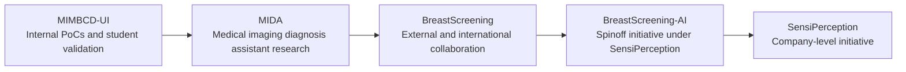

# BreastScreening-AI Research Ecosystem

This document summarizes how BreastScreening-AI relates to the surrounding
medical imaging research initiatives.

## Initiative Map

| Initiative | Role |
| --- | --- |
| [MIMBCD-UI](https://github.com/MIMBCD-UI) | Internal research ecosystem for proof-of-concept work, commonly studied and validated by Bachelor's and Master's students. Clinicians and PhD students may also contribute at initiative level. |
| [MIDA](https://github.com/mida-project) | Medical Imaging Diagnosis Assistant initiative that elevates the ecosystem and supports PhD and PostDoc research lines. |
| [BreastScreening](https://github.com/BreastScreening) | External and international research collaboration ecosystem for work with universities worldwide. |
| [BreastScreening-AI](https://github.com/BreastScreeningAI) | Spinoff initiative from Instituto Superior Tecnico, University of Lisbon, under SensiPerception. |
| [SensiPerception](https://github.com/SensiPerception) | Company-level GitHub initiative. |

## BreastScreening-AI Context

BreastScreening-AI was founded by Francisco Maria Calisto and Dr. Joao Maria
Abrantes, Radiologist and CMedO at BreastScreening-AI, before the end of
Francisco Maria Calisto's PhD on February 12, 2024.

The initiative was founded on December 22, 2023, incorporated on January 4,
2024, and operates under SensiPerception.

## Typical Movement Between Initiatives

Work may move between initiatives as it matures:

This is not a strict pipeline. Some repositories may remain in their original
initiative, and some work may be forked directly from MIMBCD-UI to MIDA when it
fits the broader research line.

## Repository Placement Guidance

Use MIMBCD-UI when the work is an internal proof of concept, early research
prototype, teaching-oriented validation effort, or student-led exploration.

Use MIDA when the work supports the Medical Imaging Diagnosis Assistant research
line, especially PhD or PostDoc research, reusable diagnosis-assistant
components, or broader medical imaging methods.

Use BreastScreening when the work is primarily an external or international
academic collaboration around breast screening.

Use BreastScreening-AI when the work belongs to the spinoff context, public
BreastScreening-AI communication, company-facing materials, or mature project
assets under SensiPerception.

Use SensiPerception for company-level materials that are not specific to the
BreastScreening-AI initiative.
